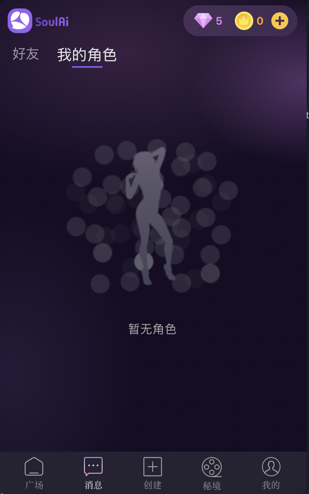
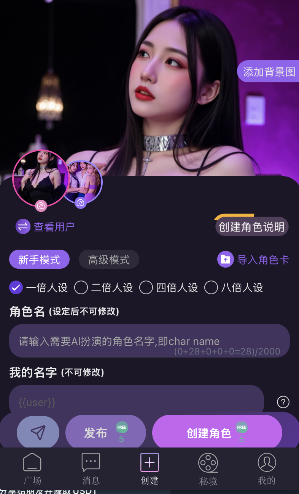
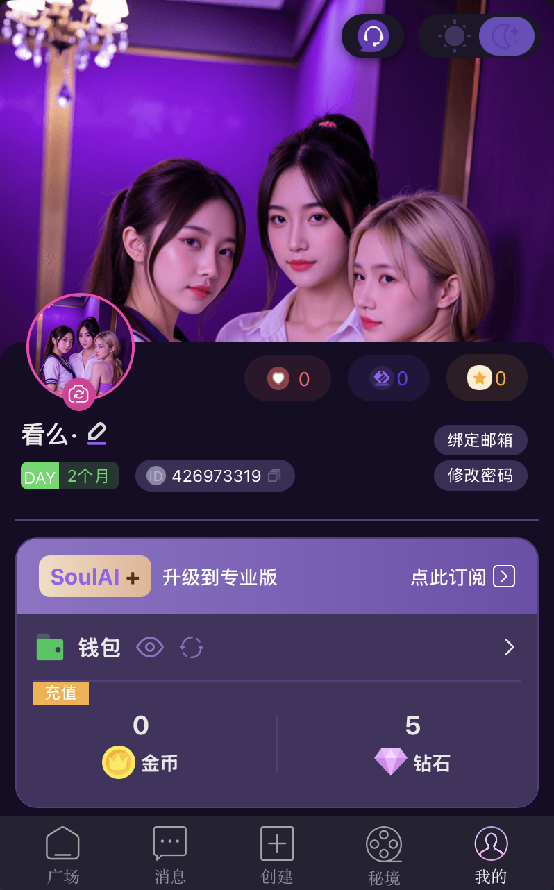
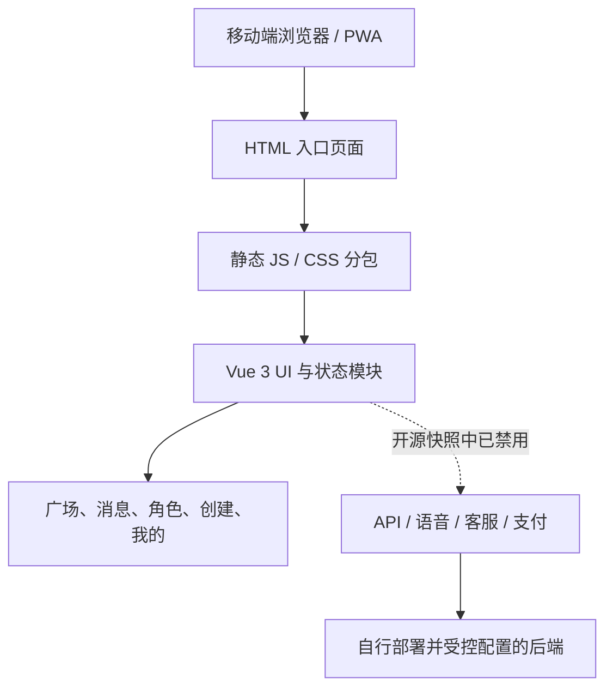

# SoulAI H5 静态前端快照

> 看么科技客服 @hwxc129 · 看么科技频道 @hwxc131

这是一个经清理后可公开查阅的 SoulAI 移动端 H5 静态前端快照。它适合用于界面、功能分层和前端交互的学习与归档；**不是原始未压缩工程，也不包含可运行的生产服务**。

原始交付物为已构建的 Vite 前端产物，缺少源码目录、依赖清单和构建配置。因此本仓库保留了可审阅的静态 HTML、JavaScript 与 CSS，同时移除了不宜公开发布的内容。

## 已移除的内容

- 完整 Git 历史、恢复/审计/抓取资料和构建标记；
- 生产 API、语音、客服、跳转和支付地址，统一替换为 `example.invalid` 占位域名；
- 独立账户/支付 SDK，以及会加载第三方支付、jQuery、node-forge 的页面入口；
- 未逐一确认授权与适宜性的原始媒体资源和用户内容；
- 基础凭据规则产生了 2 个 `token` 命中；复核后均为运行时变量拼接，不是硬编码凭据，未发现可用硬编码密钥。

因此，直接启动此快照只适合查看结构，不会连接旧生产服务，也不会提供登录、支付、语音或社区数据功能。

## 功能概览

从页面路由、静态模块和保留的界面记录可确认该客户端包含下列产品分区：

- 广场：标签筛选、搜索、内容流排序、内容卡片与互动入口；
- 消息与角色：好友/角色页签、角色列表与空状态；
- 角色创建：新手/高级模式、角色名和用户设定、角色卡导入、背景图和角色创建说明；
- 对话能力：角色会话、内容发布/评论、收藏/点赞等模块入口；
- 我的：个人资料、订阅、钱包、金币与钻石展示；
- 平台能力：PWA 图标与版本入口、多语言静态资源、主题/设备适配代码。

支付、账户和服务端数据均为原服务集成内容，已从公开版本禁用。

## 界面记录

以下为经筛选后适宜公开的开发界面记录；不包含含有不适宜内容的原始截图。

| 角色与消息 | 创建角色 | 个人中心与钱包 |
| --- | --- | --- |
|  |  |  |

## 架构



详细的模块边界、数据流和恢复开发建议见 [docs/ARCHITECTURE.md](docs/ARCHITECTURE.md)。

## 本地查看

```bash
python3 -m http.server 8080
```

访问 `http://localhost:8080` 即可查看入口和静态资源结构。由于所有生产集成均已撤除，功能请求失败是预期行为。要重新开发，请以可审计的原始源代码为基础，重新接入自有后端，而不要把旧生产地址写回构建产物。

## 安全与内容要求

- 请勿提交 `.env`、私钥、令牌、支付参数、用户数据或生产导出文件；
- 接入服务端时，所有密钥仅存放于部署平台的密钥管理系统；
- 角色、图片、文本和上传内容应经过年龄适宜性、版权、隐私与违法内容审核；
- 安全反馈流程见 [SECURITY.md](SECURITY.md)。

## 许可证

本仓库以 [MIT License](LICENSE) 发布。
