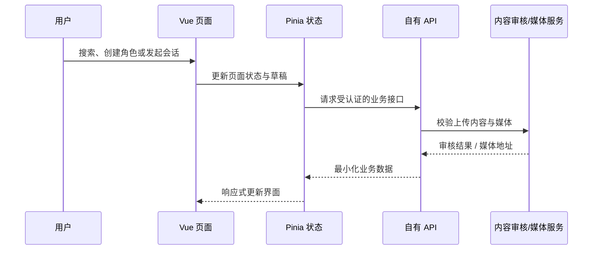

# 架构与逻辑说明

## 产物性质

本仓库来自一次前端构建结果的清理副本。可见产物表明它由 Vite 进行分包，运行时采用 Vue 3 组件体系和 Pinia 状态管理；文件名带有内容哈希，故其用途是展示既有客户端的功能边界，而不是替代原始研发工程。

## 页面与模块

| 分区 | 客户端职责 | 主要状态/数据 |
| --- | --- | --- |
| 广场 | 标签、搜索、排序、内容卡片、互动入口 | 筛选条件、内容分页、互动计数 |
| 消息 | 好友与角色切换、会话入口、空状态 | 会话列表、角色列表、未读状态 |
| 创建 | 新手/高级角色编辑、角色卡导入、背景和说明配置 | 角色草稿、编辑模式、导入文件 |
| 对话/内容 | 角色会话、发布、评论、点赞/收藏等前端流程 | 当前角色、会话上下文、内容草稿 |
| 我的 | 用户资料、会员展示、钱包/权益入口 | 用户会话、订阅状态、虚拟权益余额 |

## 典型数据流

公开快照中的 API 目标已替换成无效占位域名，图中 API 与审核服务仅描述一个安全的重新开发方向，并不代表仓库内存在这些服务。

## 建议的重新开发边界

1. 将 UI、领域状态、API 客户端和部署配置分层；不要在静态包中硬编码主机名或凭据。
2. 登录状态使用短期令牌与安全 Cookie；不要把密码或长期密钥存入 localStorage。
3. 支付、账户和媒体上传只能由自有后端发起或签发短期授权；前端不能持有商户密钥。
4. 角色图片、文本和社区内容在发布前进行权限、隐私、版权和年龄适宜性审核。
5. 为搜索、发布、上传、订阅和管理员能力分别实施授权与限流，并记录不含敏感值的审计日志。

## 目录说明

- `index.html`、`start.html`、`tch5.html`、`sch5.html`、`enh5.html`：构建后的入口与渠道页面；
- `static/`：按版本和哈希拆分的前端 JavaScript、CSS 与运行时文件；
- `lib/`：构建产物使用的第三方运行库；
- `res/icons/`：保留的 PWA 图标；
- `docs/assets/`：仅包含本次审核后允许公开的界面记录。

原始媒体、外部集成和独立 SDK 均不在公开版本中。
